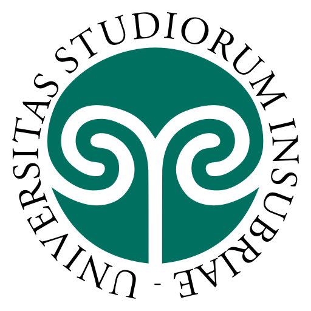
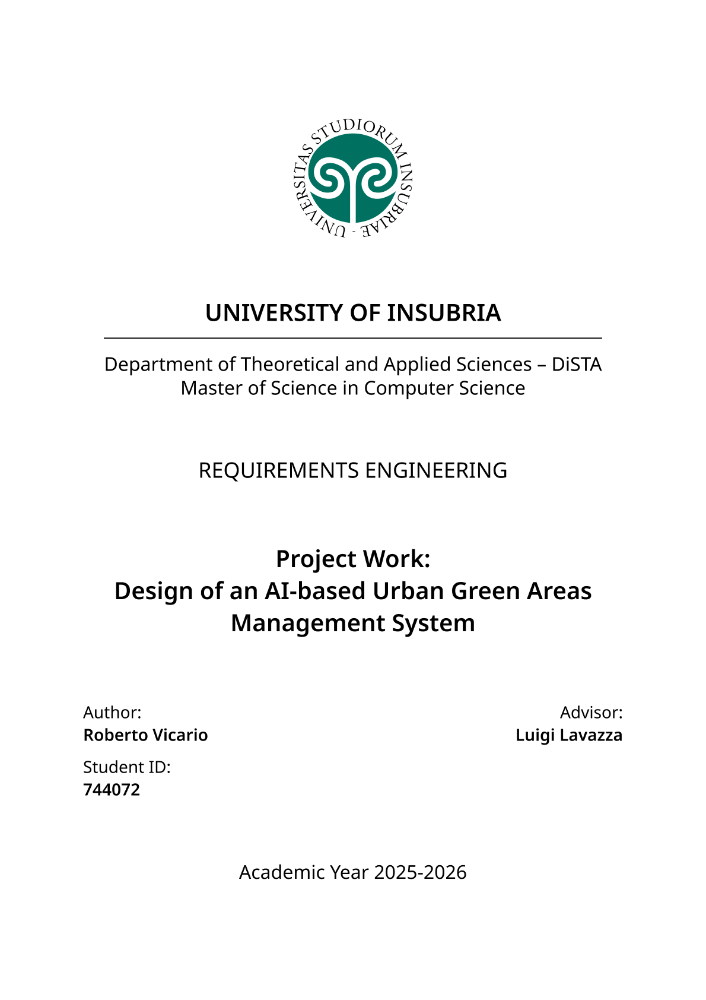

|  |
| - |

# Requirements Engineering, MSc Course @ uninsubria

This repository contains my project work for the Requirements Engineering course at the University of Insubria, part of the MSc in Computer Science.

## Overview

You can easily download my project work below, remember to use it responsibly and cite it if you reference it.

## Project Work

| <a href="https://raw.githubusercontent.com/robertovicario/uninsubria-Requirements_Engineering/main/dist/Project_Work.pdf"></a> |
| - |

## Credits

> [!WARNING]
>
> Please use this project responsibly, it was created by me for an exam session that I completed at _University of Insubria_. If you use or reference this project, please cite it as follows:
>
> ```bib
> @misc{vicario2026requirementsengineering,
>     author = {R. Vicario},
>     title  = {uninsubria-Requirements_Engineering},
>     year   = {2026},
>     url    = {https://github.com/robertovicario/uninsubria-Requirements_Engineering}
> }
> ```

## License

This project is distributed under [GNU General Public License version 3](https://opensource.org/license/gpl-3-0). You can find the complete text of the license in the project repository.
